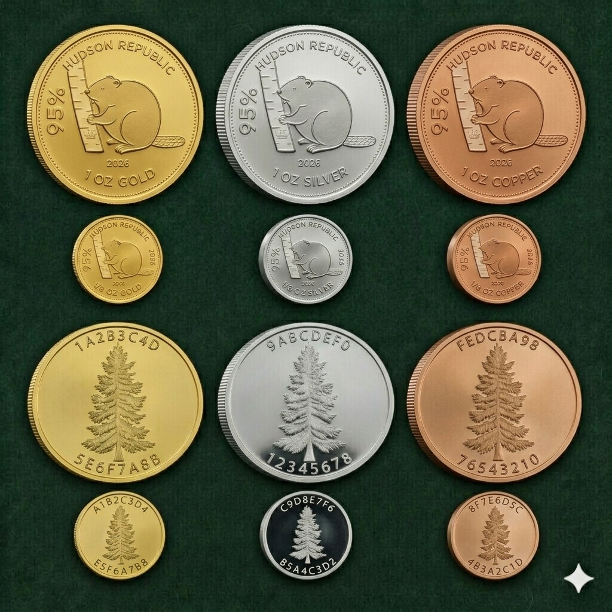
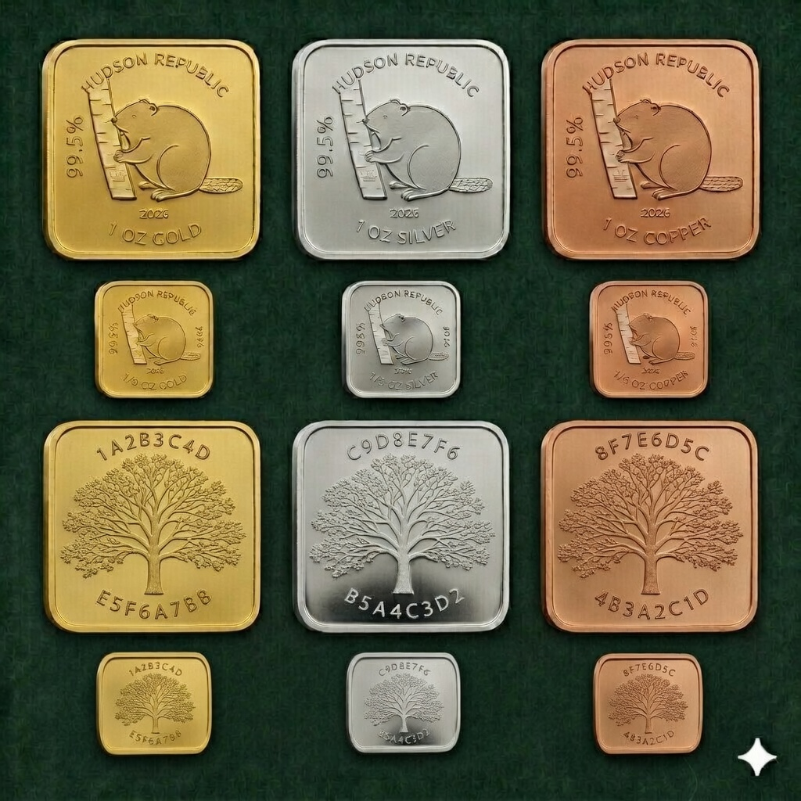

# Bullion Standards and Conversion Act

---

## Hard Dependencies
List any legislative instrument(s) (in alphabetical order) that this article must depend on. List the FQLN(s) below. Any FQLN(s) mentioned in other sections are considered to be references and not actual dependencies.  
Only **Constitutional Articles (CA)** and **Legislative Articles (LA)** can be listed here.

Dependencies
* **[CA_BANKANDRESERVE_20260401](../CA/CA_BANKANDRESERVE_20260401.md)**  
* **[CA_LEGALTENDER_20260401](../CA/CA_LEGALTENDER_20260401.md)**  
* **[CA_THEINDIVIDUAL_20260401](../CA/CA_THEINDIVIDUAL_20260401.md)**

---

## Definitions
All capitalized terms used in this Act shall be interpreted in accordance with their definitions in the referenced instruments below.

- **Gold spot price**: The publicly verifiable international market price per troy ounce of 99.99% or higher purity gold.  
- **Ledger Unit**: The base indivisible accounting denomination, equal to 1/8 troy ounce of 95% pure copper bullion.

---

## Preamble
This Act establishes the fixed bullion ratios, conversion rules, rounding protocols, binary representation mechanics, and specifications for coinage and institutional bars. All provisions operate in accordance with the rights of the Individual as protected under **[The Individual (Sovereign) Act](../CA/CA_THEINDIVIDUAL_20260401.md)** and the **[Legal Tender Act](../CA/CA_LEGALTENDER_20260401.md)**.

---

## Section 1 — Fixed Bullion Ratios (64 : 64 : 8)
* 64 troy ounces of silver = 1 troy ounce of gold  
* 64 troy ounces of copper = 1 troy ounce of silver  
* 8 × 1/8 troy ounce copper pieces = 1 troy ounce of copper

---

## Section 2 — Smallest Unit
The base Ledger accounting unit is 1/8 troy ounce of 95% pure copper. The maximum precision of the Ledger is 32,768 × 1/8 troy ounce copper units (64 × 64 × 8).

---

## Section 3 — Founders Edition Reference Coins
The Founders Edition establishes circulation standards for coins. Institutional bars (99.5% purity) are reserved exclusively for banking, trusts, savings, and reserves.

### Founders Edition Coins
**Obverse (Heads) – Common to All Editions**  
* “HUDSON REPUBLIC” in all capital letters along the top ridge.  
* Central image: Beaver gnawing on wood.  
* Purity percentage displayed along the left or right ridge.  
* Weight (“1/8 OZ” or “1 OZ”) displayed along the bottom ridge.  

**Obverse – 1 oz Coins**  
* Year (full YYYY format) displayed directly underneath the beaver.  

**Obverse – 1/8 oz Coins**  
* Year (full YYYY format) displayed along the left or right ridge of the beaver.  

**Reverse (Tails)**  
* 16-character hexadecimal serial number for unique internal tracking and circulation control.  
* The serial is split into two groups of eight characters: one group along the top ridge and the second group along the bottom ridge.  
* Central design: Beaver gnawing on an oak tree (shared motif across all metal types, differentiated by weight).

**Coin Composition and Dimensions**

| Coin Code | Metal  | Bullion Alloy (95%) | Hardener (5%) | Diameter | Thickness |
|-----------|--------|---------------------|---------------|----------|-----------|
| HGB1      | Gold   | Gold                | Copper        | 32 mm    | 2.17 mm   |
| HGB8      | Gold   | Gold                | Copper        | 16 mm    | 1.08 mm   |
| HSB1      | Silver | Silver              | Copper        | 32 mm    | 3.91 mm   |
| HSB8      | Silver | Silver              | Copper        | 16 mm    | 1.95 mm   |
| HCB1      | Copper | Copper              | Iron          | 32 mm    | 4.57 mm   |
| HCB8      | Copper | Copper              | Iron          | 16 mm    | 2.28 mm   |

Coinage Render

---

## Section 4 — Institutional Bars (99.5% Purity)
All institutional bars maintain a consistent square cross-section per metal, enabling perfect modular stacking in vaults (a 10 oz bar equals ten 1 oz bars in footprint).

| Coin Code | Metal    | Weight     | Pure Metal | Gross Mass | Length × Width     | Thickness |
|-----------|----------|------------|------------|------------|--------------------|-----------|
| GBB8      | Gold     | 1/8 oz     | 3.88 g     | 3.91 g     | 10.1 mm × 10.1 mm  | 2.0 mm    |
| GBB1      | Gold     | 1 oz       | 31.10 g    | 31.26 g    | 28.5 mm × 28.5 mm  | 2.0 mm    |
| GSB5      | Gold     | 5 oz       | 155.52 g   | 156.3 g    | 28.5 mm × 28.5 mm  | 10.0 mm   |
| GSB1      | Gold     | 10 oz      | 311.03 g   | 312.60 g   | 28.5 mm × 28.5 mm  | 20.0 mm   |
| GSB0      | Gold     | 100 oz     | 3,110.35 g | 3,126.00 g | 28.5 mm × 28.5 mm  | 200.0 mm  |
| SBB8      | Silver   | 1/8 oz     | 3.88 g     | 3.91 g     | 13.7 mm × 13.7 mm  | 2.0 mm    |
| SBB1      | Silver   | 1 oz       | 31.10 g    | 31.26 g    | 38.6 mm × 38.6 mm  | 2.0 mm    |
| SSB5      | Silver   | 5 oz       | 155.52 g   | 156.3 g    | 38.6 mm × 38.6 mm  | 10.0 mm   |
| SSB1      | Silver   | 10 oz      | 311.03 g   | 312.60 g   | 38.6 mm × 38.6 mm  | 20.0 mm   |
| SSB0      | Silver   | 100 oz     | 3,110.35 g | 3,126.00 g | 38.6 mm × 38.6 mm  | 200.0 mm  |
| CBB8      | Copper   | 1/8 oz     | 3.88 g     | 3.91 g     | 14.8 mm × 14.8 mm  | 2.0 mm    |
| CBB1      | Copper   | 1 oz       | 31.10 g    | 31.26 g    | 41.8 mm × 41.8 mm  | 2.0 mm    |
| CSB5      | Copper   | 5 oz       | 155.52 g   | 156.3 g    | 41.8 mm × 41.8 mm  | 10.0 mm   |
| CSB1      | Copper   | 10 oz      | 311.03 g   | 312.60 g   | 41.8 mm × 41.8 mm  | 20.0 mm   |
| CSB0      | Copper   | 100 oz     | 3,110.35 g | 3,126.00 g | 41.8 mm × 41.8 mm  | 200.0 mm  |

Institutional Bars Render

---

**Original Author**: 

**House Signature**: 

**Senate Signature**: 

**Executive Office Signature**: 

**FQLN**: LA_BULLIONSTANDARDS_20260401
